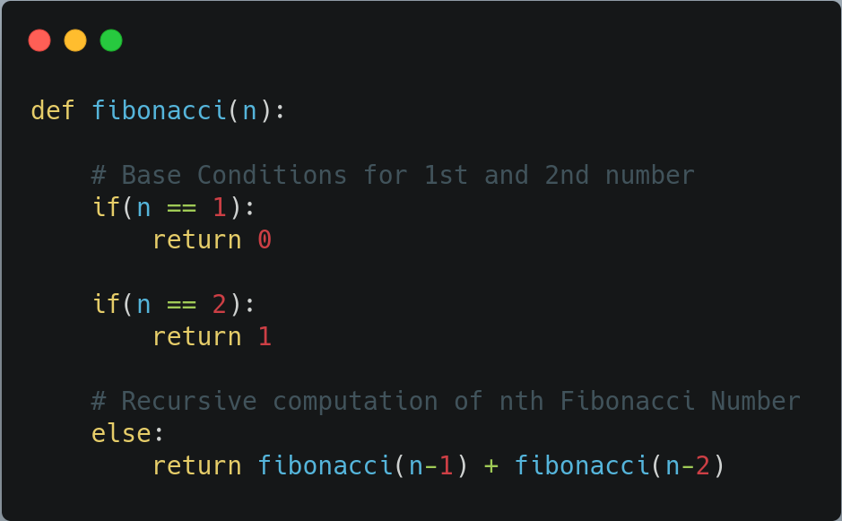

# INTRODUCTION TO DYNAMIC PROGRAMMING ---> (GAME CHANGER)

- Overlapping sub problems
- need to optimize this problem
- can be done using dynamic programming

## RECURSSIVE APPROACH OF A NOOB ----> (Exponential time complexity)



## APPROACHES TO DP

- We will use the example of FIBONACCI SERIES from leet code to understand the concept of memoization and tabulation
    - The Fibonacci numbers, commonly denoted F(n) form a sequence, called the Fibonacci sequence, such that each number is the sum of the two preceding ones, starting from 0 and 1. That is,

    F(0) = 0, F(1) = 1
    F(n) = F(n - 1) + F(n - 2), for n > 1.
    #### *Given n, calculate F(n).*

![Alt Text][2]

[2]: https://avikdas.com/assets/images/2019-04-15-visual-introduction-to-dynamic-programming/fibonacci-naive.png

### TOP-DOWN APPROACH (MEMOIZATION)

- CODE GIVEN IS :
```
        class Solution {
        public:
            int topDownSolve(int n, vector<int>& dp) {
                // Base case
                if(n==0 || n==1) return n;

                // Step 3: check if ans already exist
                if(dp[n] != -1) {
                    return dp[n];
                }

                //step 2 : replace ans with dp[n]
                dp[n] =topDownSolve(n-1,dp) + topDownSolve(n-2,dp);
                return dp[n];
            }
            int fib(int n) {
                // Step 1 : Create a DP array
                vector<int> dp(n+1,-1);
                int ans = topDownSolve(n,dp);
                return ans;
            }
        };
```


### BOTTOM-UP APPROACH (TABULATION)

- CODE GIVEN IS :
```
        int bottomUpSolve(int n) {
            //step1: create dp array
            vector<int> dp(n+1,-1);

            //step2: observe base case in above condition
            if(n==0) return 0;
            if(n==1) return 1;
            dp[0] = 0;
            dp[1] = 1;

            //step 3: 
            for(int i = 2; i <= n; i++ ) {
                dp[i] = dp[i-1] + dp[i-2];
            }

            return dp[n];
        }
        int fib(int n) {
            return bottomUpSolve(n);
        }
```

## DIFFERENCE BETWEEN THE TWO APPROACHES

![Alt Text][1]

[1]: https://media.geeksforgeeks.org/wp-content/cdn-uploads/Tabulation-vs-Memoization-1.png
