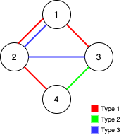
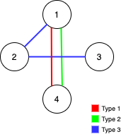
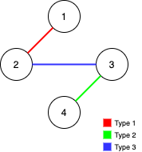

# 1579. Remove Max Number of Edges to Keep Graph Fully Traversable
## Hard
```
Alice and Bob have an undirected graph of n nodes and three types of edges:

Type 1: Can be traversed by Alice only.
Type 2: Can be traversed by Bob only.
Type 3: Can be traversed by both Alice and Bob.
Given an array edges where edges[i] = [typei, ui, vi] represents a bidirectional edge of type typei between nodes ui and vi, find the maximum number of edges you can remove so that after removing the edges, the graph can still be fully traversed by both Alice and Bob. The graph is fully traversed by Alice and Bob if starting from any node, they can reach all other nodes.

Return the maximum number of edges you can remove, or return -1 if Alice and Bob cannot fully traverse the graph.
```

Example 1:




> Input: n = 4, edges = [[3,1,2],[3,2,3],[1,1,3],[1,2,4],[1,1,2],[2,3,4]]

> Output: 2
Explanation: If we remove the 2 edges [1,1,2] and [1,1,3]. The graph will still be fully traversable by Alice and Bob. Removing any additional edge will not make it so. So the maximum number of edges we can remove is 2.
Example 2:



> Input: n = 4, edges = [[3,1,2],[3,2,3],[1,1,4],[2,1,4]]

> Output: 0
Explanation: Notice that removing any edge will not make the graph fully traversable by Alice and Bob.
Example 3:



> Input: n = 4, edges = [[3,2,3],[1,1,2],[2,3,4]]

> Output: -1
Explanation: In the current graph, Alice cannot reach node 4 from the other nodes. Likewise, Bob cannot reach 1. Therefore it's impossible to make the graph fully traversable.


# Solution

## Intuition
    To solve this problem, we need to ensure that both Alice and Bob can traverse the entire graph independently. This can be achieved by ensuring each has a connected graph (spanning tree). Using the Union-Find data structure, we can efficiently manage the connectivity of the graph. The goal is to maximize the number of edges removed while ensuring both Alice and Bob can still traverse all nodes.

## Approach
1. **Initialize Union-Find Structures**: Create two separate Union-Find structures, one for Alice and one for Bob, to manage their connectivity.
2. **Process Type 3 Edges First**: Type 3 edges are the most valuable because they can be used by both Alice and Bob. We iterate through these edges first and attempt to add them to both Alice's and Bob's graphs. If the edge successfully connects two previously unconnected components for either Alice or Bob, it is necessary.
3. **Process Type 1 and Type 2 Edges**: After handling type 3 edges, we separately process type 1 edges for Alice and type 2 edges for Bob. These edges are only useful if they connect new components for Alice or Bob, respectively.
4. **Check Full Connectivity**: After processing all edges, we check if both Alice's and Bob's graphs are fully connected.
5. **Calculate Removable Edges**: The number of removable edges is the total number of edges minus the number of edges required to ensure full connectivity for both Alice and Bob.

